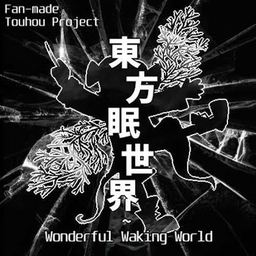

# thWWW-switch

<p align="center">
  
</p>

A native Nintendo Switch homebrew port of **東方眠世界 ~ Wonderful Waking World 1.0.1** by Oligarchomp.

This is a game-specific AArch64/libnx port built on the open-source [Butterscotch](https://github.com/ButterscotchRunner/Butterscotch) GameMaker runner. It is not a forwarder, LayeredFS patch, retail GameMaker runner injection, or renamed placeholder. The original game data is not included.

## Status

The port's corrected runtime build has been tested on physical Nintendo Switch hardware and confirmed working, including gameplay visibility, player damage, stage music, spell/background transitions, and dense danmaku. The public build retains those fixes and adds the fixed Saekaze-style controls, dedicated held dialogue skip, supplied icon, and `SWITCH` score name.

For best results, launch hbmenu through **title takeover/full-memory mode**. The game uses large texture pages and uncompressed PCM music, so applet mode may not provide enough memory.

## Installation

### Manual

1. Download the official free Windows release of Wonderful Waking World 1.0.1 from [Oligarchomp's itch.io page](https://oligarchomp.itch.io/wonderful-waking-world).
2. Create `sd:/switch/thwww/` on the SD card.
3. Place `thwww.nro` in that folder.
4. Extract the official archive into the same folder. `thWWW.exe` is not required.
5. Launch **Wonderful Waking World** from hbmenu.

The resulting layout should include:

```text
sd:/switch/thwww/
├── thwww.nro
├── data.win
├── options.ini
├── font/
├── music/
├── text/
└── save/
```

If `data.win` is missing, the NRO displays an installation message instead of silently returning to hbmenu.

### Automated installer

From this repository:

```sh
./scripts/package-thwww-sd.sh /path/to/thWWW_1.0.1.zip /path/to/sd-root
```

The script verifies the known official archive and `data.win` hashes, excludes the Windows executable, installs the NRO, and creates the writable save folder.

## Controls

The Switch layout is fixed to match Saekaze's Touhou 7 Switch port. Saved PC/gamepad remappings do not change these physical Switch controls.

| Switch control | Action |
|---|---|
| Left stick / D-Pad | Move / menu navigation |
| **B** | Shoot / confirm |
| **A** | Bomb / cancel |
| **L** | Focus |
| **R** (hold) | Skip dialogue |
| **Plus** | Pause |
| All other buttons / right stick | No action |

R is a dedicated dialogue action: it is not globally aliased to shooting.

## Saves, scores, and replays

Runtime writes are redirected to:

```text
sd:/switch/thwww/save/
```

This includes `Data.ini` and working-directory-prefixed replay files. Reads prefer the save copy and fall back to the original game folder. Back up `save/` before replacing an installation.

New score entries use the fixed name **`SWITCH`**. Existing leaderboard names remain unchanged.

## Building

Install a current devkitPro Switch toolchain containing devkitA64, libnx, Switch SDL2, OpenAL, zlib, bzip2, and the standard Switch portlibs. Then run:

```sh
./scripts/build-thwww-switch.sh
```

The build script uses `${DEVKITPRO}/portlibs/switch/bin/aarch64-none-elf-cmake`, enables the WAD 17 runtime and modern GLES renderer, treats warnings as errors, and writes the NRO, NACP, ELF, checksums, and release notes to `release/`.

Useful overrides:

```sh
DEVKITPRO=/opt/devkitpro \
THWWW_BUILD_DIR=/tmp/thwww-switch-build \
CMAKE_BUILD_PARALLEL_LEVEL=8 \
./scripts/build-thwww-switch.sh
```

## What was ported and fixed

The game-specific work includes:

- GameMaker 2022.5 / WAD 17 bytecode compatibility for all functions referenced by thWWW;
- runtime TTF atlas generation, including Japanese glyph coverage;
- queued low-memory OpenAL streaming for thWWW's large runtime-created WAV tracks;
- state-aware OpenAL pause/resume so repeated resume calls do not restart BGM;
- GameMaker event-end instance activation semantics, including nested Destroy events;
- precise pooled-danmaku collision and spatial-grid reactivation correctness;
- a measured 20–24% host CPU improvement in dense stage-5 patterns without reducing collision work;
- thWWW's game-specific stage-background draw bands and modern GLES surface/depth behavior;
- vertex formats and triangle-list buffers used by stage 5 and stage 7 backgrounds;
- a read-only game-data layer with writable saves/replays under `save/`;
- fixed Switch controls, dedicated R dialogue skip, `SWITCH` score naming, NACP metadata, and icon assets.

Technical evidence is available in:

- [`docs/VALIDATION.md`](docs/VALIDATION.md)
- [`docs/PERFORMANCE.md`](docs/PERFORMANCE.md)
- [`docs/RESEARCH.md`](docs/RESEARCH.md)

## Integrity references

Known official 1.0.1 files:

```text
thWWW_1.0.1.zip  f81d50d17bd337c059016e57e77e21be3827b20027ab82dc2b69242d65062477
data.win          200dc6a8f5b1e0de8d76d531001bcb886f7c2cc74859a30f3d324f6f5bc782e3
```

These hashes identify the supported release; neither file is part of this repository.

## Credits

- **Oligarchomp** — Wonderful Waking World
- **Team Shanghai Alice / ZUN** — Touhou Project
- **Butterscotch contributors** — open-source GameMaker runner
- **Saekaze** — Touhou 7 Switch control and repository precedent
- **devkitPro, libnx, SDL, OpenAL, and stb contributors** — toolchain and libraries

## Legal notice

This is an unofficial community compatibility port. It is not affiliated with or endorsed by Oligarchomp, Team Shanghai Alice, Nintendo, or YoYo Games.

No Wonderful Waking World `data.win`, music, fonts, text, Windows executable, proprietary Nintendo SDK component, or proprietary GameMaker Switch runtime is distributed. Users must obtain the free official PC release themselves.

The runner source is provided under the **GNU Affero General Public License v3.0** in [`LICENSE`](LICENSE). Vendored components retain their own notices and licenses.
