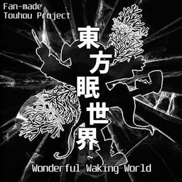

# thWWW-switch

<p align="center">
  
</p>

A native Nintendo Switch homebrew port of **東方眠世界 ~ Wonderful Waking World 1.0.1** by Oligarchomp.

This is a game-specific AArch64/libnx port built on the open-source [Butterscotch](https://github.com/ButterscotchRunner/Butterscotch) GameMaker runner. It is not a forwarder, LayeredFS patch, retail GameMaker runner injection, or renamed placeholder. The original game data is not included.

## Status

The port's corrected runtime build has been tested on physical Nintendo Switch hardware and confirmed working, including gameplay visibility, player damage, stage music, spell/background transitions, and dense danmaku. The October 2026 update fixes the stage 5 background, makes dense Lunatic patterns about 24% cheaper to run (an overclock is still recommended for Lunatic, see [Performance and CPU clock](#performance-and-cpu-clock)), makes the controls remappable in the game's own Key Config, and brings back the game's name entry for scores and replays.


## Installation

### Manual

1. Download the official free Windows release of Wonderful Waking World 1.0.1 from [Oligarchomp's itch.io page](https://oligarchomp.itch.io/wonderful-waking-world).
2. Create `sd:/switch/thwww/` on the SD card.
3. Place `thwww.nro` in that folder.
4. Extract the official archive into the same folder. `thWWW.exe` is not required.
5. Launch **Wonderful Waking World** from hbmenu or forwarder.

The resulting layout should include:

```text
sd:/switch/thwww/
├── thwww.nro
├── data.win
├── options.ini
├── font/
├── music/
├── text/
└── save/
```

If `data.win` is missing, the NRO displays an installation message instead of silently returning to hbmenu.

### Automated installer

From this repository:

```sh
./scripts/package-thwww-sd.sh /path/to/thWWW_1.0.1.zip /path/to/sd-root
```

The script verifies the known official archive and `data.win` hashes, excludes the Windows executable, installs the NRO, and creates the writable save folder.

## Controls


| Switch control | Action |
|---|---|
| Left stick / D-Pad | Move / menu navigation |
| **B** | Shoot / confirm |
| **A** | Bomb / cancel |
| **L / ZL** | Focus |
| **R / ZR** (hold) | Skip dialogue |
| **Plus** | Pause |
| **X**, **Y** | Free for Key Config |

**The same default layout as the other Touhou Switch ports.** These are only defaults: the Switch buttons act as the game's own gamepad, so **Option → Key Config** can rebind shot, focus, bomb and pause (saved in `Data.ini`). B, A, L/ZL, R/ZR, +, X and Y can be picked; the D-Pad and sticks only move. R/ZR always skips dialogue while held, without becoming a second shoot button in gameplay. Minus and the right stick do nothing.

## Saves, scores, and replays

Runtime writes are redirected to:

```text
sd:/switch/thwww/save/
```

This includes `Data.ini` and working-directory-prefixed replay files. Each save is written to a `.tmp` file first and then swapped in, so a crash or power loss while saving cannot leave a truncated `Data.ini`. Reads prefer the save copy and fall back to the original game folder. Back up `save/` before replacing an installation.

High scores and replays use the game's own name entry (pick the letters with the D-Pad and confirm with shot), and the name is remembered in `Data.ini`. Earlier builds of this port forced the name `SWITCH`; those leaderboard entries stay as they are.

## Performance and CPU clock

The port runs at the Switch's stock clocks; it does not change them.

**An overclock is recommended for Lunatic playthroughs.** thWWW is a GameMaker game, so every bullet runs GameMaker script code through an interpreter. On the hardest Lunatic spell cards that is several hundred bullets running their scripts every frame, and at the stock 1020 MHz CPU clock the Switch runs them at 49–57 FPS (mostly around 55). With the CPU overclocked (tested docked with a ~1.7 GHz overclock) those cards hold 60 FPS; a smaller overclock will probably be enough.

This update also cut the port's own CPU work on dense Lunatic patterns by about 24% (measured on PC across Lunatic stages 3–5, with identical game state frame by frame), but the remaining cost is the game's own scripts. Holding 60 FPS at stock clocks there would need those scripts compiled to native code instead of interpreted, which is a much larger project. See [`docs/PERFORMANCE.md`](docs/PERFORMANCE.md).

## Building

Install a current devkitPro Switch toolchain containing devkitA64, libnx, Switch SDL2, OpenAL, zlib, bzip2, and the standard Switch portlibs. Then run:

```sh
./scripts/build-thwww-switch.sh
```

The build script uses `${DEVKITPRO}/portlibs/switch/bin/aarch64-none-elf-cmake`, enables the WAD 17 runtime and modern GLES renderer, treats warnings as errors, and writes the NRO, NACP, ELF, checksums, and release notes to `release/`.

Useful overrides:

```sh
DEVKITPRO=/opt/devkitpro \
THWWW_BUILD_DIR=/tmp/thwww-switch-build \
CMAKE_BUILD_PARALLEL_LEVEL=8 \
./scripts/build-thwww-switch.sh
```

## What was ported and fixed

The game-specific work includes:

- GameMaker 2022.5 / WAD 17 bytecode compatibility for all functions referenced by thWWW;
- runtime TTF atlas generation, including Japanese glyph coverage;
- queued low-memory OpenAL streaming for thWWW's large runtime-created WAV tracks;
- state-aware OpenAL pause/resume so repeated resume calls do not restart BGM;
- GameMaker event-end instance activation semantics, including nested Destroy events;
- precise pooled-danmaku collision and spatial-grid reactivation correctness;
- a measured 20–24% host CPU improvement in dense stage-5 patterns without reducing collision work;
- GameMaker's 3D drawing rules for the stage backgrounds: sprites are drawn at their layer depth and clipped by GameMaker's (Direct3D-style) near plane, so the stage 5 tunnel looks like the PC game and the 3D backgrounds stay out of the 2D gameplay view;
- instances on hidden room layers are not drawn (thWWW's playfield walls);
- a further ~24% less CPU on dense Lunatic patterns (collision pre-check, ancestry table, cheaper dead-reference sweep, grouped draw sorting, interpreter dispatch, `-O3`);
- modern GLES surface/depth behavior;
- vertex formats and triangle-list buffers used by stage 5 and stage 7 backgrounds;
- a read-only game-data layer with writable saves/replays under `save/`;
- remappable Switch controls through the game's Key Config, dedicated R/ZR dialogue skip, the game's own name entry, NACP metadata, and icon assets.

Technical evidence is available in:

- [`docs/VALIDATION.md`](docs/VALIDATION.md)
- [`docs/PERFORMANCE.md`](docs/PERFORMANCE.md)
- [`docs/RESEARCH.md`](docs/RESEARCH.md)

## Integrity references

Known official 1.0.1 files:

```text
thWWW_1.0.1.zip  f81d50d17bd337c059016e57e77e21be3827b20027ab82dc2b69242d65062477
data.win          200dc6a8f5b1e0de8d76d531001bcb886f7c2cc74859a30f3d324f6f5bc782e3
```

These hashes identify the supported release; neither file is part of this repository.

## Credits

- **Oligarchomp** — Wonderful Waking World
- **Team Shanghai Alice / ZUN** — Touhou Project
- **Butterscotch contributors** — open-source GameMaker runner
- **devkitPro, libnx, SDL, OpenAL, and stb contributors** — toolchain and libraries

## Legal notice

This is an unofficial community compatibility port. It is not affiliated with or endorsed by Oligarchomp, Team Shanghai Alice, Nintendo, or YoYo Games.

No Wonderful Waking World `data.win`, music, fonts, text, Windows executable, proprietary Nintendo SDK component, or proprietary GameMaker Switch runtime is distributed. Users must obtain the free official PC release themselves.

The runner source is provided under the **GNU Affero General Public License v3.0** in [`LICENSE`](LICENSE). Vendored components retain their own notices and licenses.
